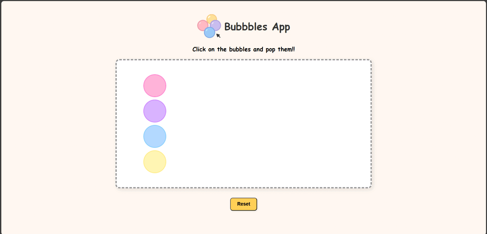

# 🫧 Bubbles Pop Game

> A simple interactive bubble-popping game built using **HTML5 Canvas** and **Vanilla JavaScript**.

![Bubbles App Demo]

## 🎮 Game Demo



*See the bubbles in action in the demo above.*

---

## ✨ Overview

This project is a lightweight, interactive canvas game where users can click on colorful bubbles to pop them. The goal is to demonstrate proficiency with **HTML5 Canvas** and **JavaScript** by building an engaging, responsive mini-game without relying on any external libraries.

---

## 🔑 Features

- Four pastel-colored interactive bubbles
- Click to pop bubbles with animated arrows
- Visual feedback on hover and pop
- Reset button to replay
- Responsive and lightweight (HTML5 Canvas & Vanilla JS)

---

## 🚀 Getting Started

1. **Clone the Repository:**
   ```bash
   git clone https://github.com/lakshu2702/bubbles_app
   cd bubbles_app
   ```

2. **Open the Game:**
   Simply open `index.html` in any modern web browser.

---

## 🛠️ Technical Details

### Technologies Used:
- **HTML5 Canvas** for rendering graphics
- **Vanilla JavaScript** for interactions and animations
- **CSS3** for layout and styling

### Core Implementations:
- **Canvas Drawing:** All visuals rendered using the Canvas API.
- **Collision Detection:** Simple distance formula to detect bubble clicks.
- **Animations:** Smooth arrow movement using `requestAnimationFrame`.
- **Responsive Layout:** Scales to fit different screen sizes.

---